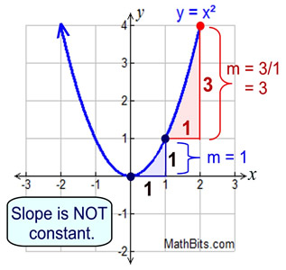
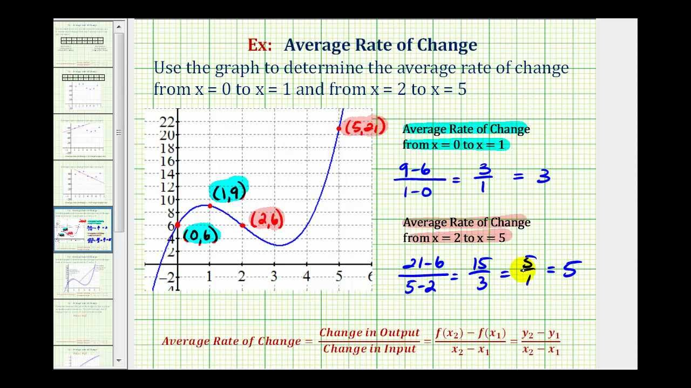

# Cómo calcular la taza promedio de cambio en una ecuación

Para éste desafío quise enfocarme un poco (aunque el tiempo no me alcanzó) en poder utilizar un lenguaje de programación como javascript para poder resolver problemas del ábmbito científico,
ya que me parece una de las applicaiones más facinantes e interesantes en ciencias de la computación. Para la próxima, implemento los graficos XD para quede mucho mas claro mi ejemplo..

